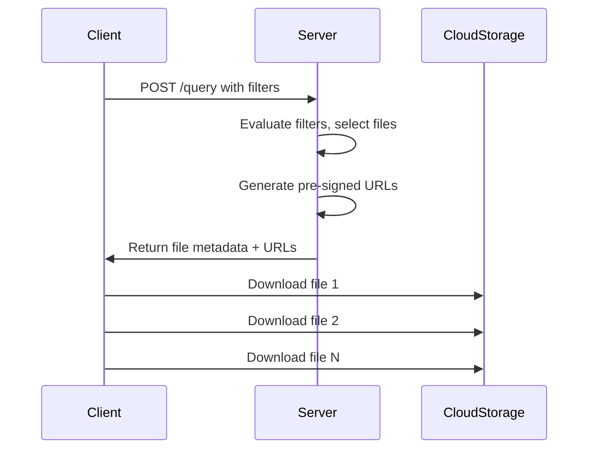
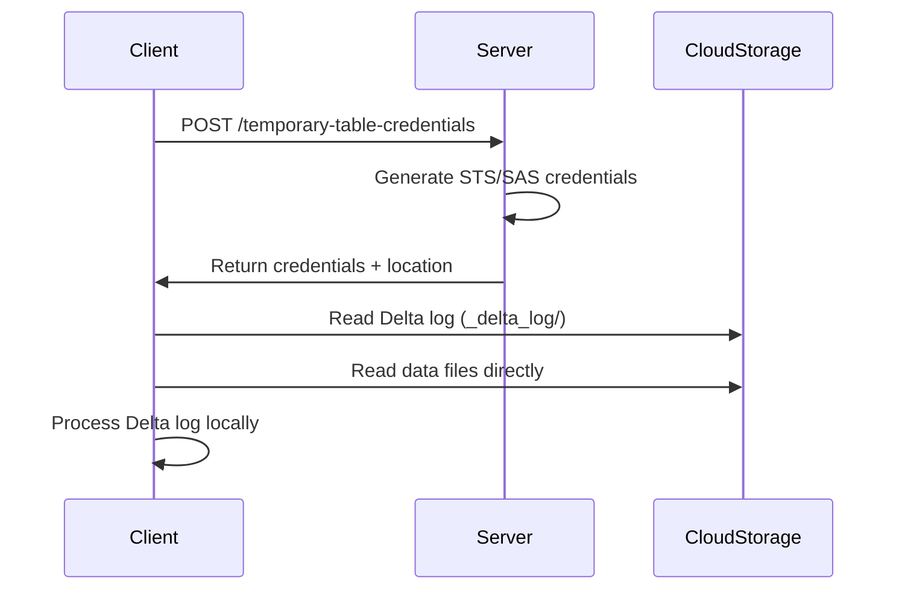

Delta Sharing supports two distinct access modes for reading table data: **URL-based access** and **directory-based access**. Each mode offers different trade-offs between simplicity and performance.

## Overview

The access mode determines how clients retrieve data files from shared tables:

<CardGroup cols={2}>
  <Card title="URL-based Access" icon="link">
    Server provides pre-signed URLs for individual data files. Simple but requires per-file URL generation.
  </Card>
  <Card title="Directory-based Access" icon="folder">
    Server issues temporary cloud credentials for direct access to table directories. More efficient for advanced query engines.
  </Card>
</CardGroup>

## URL-based Access

In URL-based access mode, the server returns pre-signed URLs for individual data files through the Query Table API.

### How It Works



<Steps>
  <Step title="Request Data">
    Client calls the Query Table API with optional predicates and limits
  </Step>
  <Step title="Receive URLs">
    Server returns NDJSON response with pre-signed URLs for each file
  </Step>
  <Step title="Download Files">
    Client downloads data files directly from cloud storage using the URLs
  </Step>
</Steps>

### Request Example

```http
POST /shares/vaccine_share/schemas/acme_vaccine_data/tables/vaccine_patients/query
Authorization: Bearer {token}
Content-Type: application/json

{
  "predicateHints": ["date >= '2021-01-01'"],
  "limitHint": 1000
}
```

### Response Example

```json
{"protocol":{"minReaderVersion":1}}
{"metaData":{"id":"f8d5c169-...","format":{"provider":"parquet"},"schemaString":"..."}}
{"file":{"url":"https://s3.us-west-2.amazonaws.com/bucket/table/date=2021-04-28/part-00000.parquet?X-Amz-Signature=...","id":"591723a8-...","size":573,"partitionValues":{"date":"2021-04-28"}}}
{"file":{"url":"https://s3.us-west-2.amazonaws.com/bucket/table/date=2021-04-28/part-00001.parquet?X-Amz-Signature=...","id":"8b0086f2-...","size":612,"partitionValues":{"date":"2021-04-28"}}}
```

### Advantages

<AccordionGroup>
  <Accordion title="Simplicity">
    - Easy to implement for both clients and servers
    - Works with any HTTP client
    - No special cloud credentials required
  </Accordion>
  
  <Accordion title="Fine-grained Control">
    - Server controls exactly which files are accessible
    - URLs can have short expiration times
    - File-level access tracking
  </Accordion>
  
  <Accordion title="Universal Compatibility">
    - Works across all cloud providers
    - No client-side cloud SDK dependencies
    - Firewall-friendly (standard HTTPS)
  </Accordion>
</AccordionGroup>

### Limitations

<Warning>
**Performance Considerations**
- Server must generate a pre-signed URL for each file
- Additional latency for URL generation
- Cannot leverage Delta log optimizations
- Not ideal for tables with thousands of files
</Warning>

## Directory-based Access

In directory-based access mode, the server issues temporary cloud credentials that grant read access to the table's root directory and Delta log.

### How It Works



<Steps>
  <Step title="Request Credentials">
    Client calls Generate Temporary Table Credential API
  </Step>
  <Step title="Receive Credentials">
    Server returns temporary cloud credentials (AWS STS, Azure SAS, or GCP OAuth)
  </Step>
  <Step title="Direct Access">
    Client accesses Delta log and data files directly using cloud storage APIs
  </Step>
  <Step title="Local Processing">
    Query engine processes Delta log locally for advanced optimizations
  </Step>
</Steps>

### Request Example

```http
POST /shares/vaccine_share/schemas/acme_vaccine_data/tables/vaccine_patients/temporary-table-credentials
Authorization: Bearer {token}
Content-Type: application/json

{
  "location": "s3://deltasharing/vaccine_share/acme_vaccine_data/vaccine_patients"
}
```

### Response Examples

<Tabs>
  <Tab title="AWS">
    ```json
    {
      "credentials": {
        "location": "s3://deltasharing/vaccine_share/acme_vaccine_data/vaccine_patients",
        "awsTempCredentials": {
          "accessKeyId": "ASIAXXXXXXXXXXX",
          "secretAccessKey": "xxxxxxxxxxxxx",
          "sessionToken": "xxxxxxxxxxxxx"
        },
        "expirationTime": 1718298900000
      }
    }
    ```
  </Tab>
  
  <Tab title="Azure">
    ```json
    {
      "credentials": {
        "location": "abfss://container@account.dfs.core.windows.net/path",
        "azureUserDelegationSas": {
          "sasToken": "sv=2021-06-08&ss=b&srt=sco&sp=r&se=..."
        },
        "expirationTime": 1718298900000
      }
    }
    ```
  </Tab>
  
  <Tab title="GCP">
    ```json
    {
      "credentials": {
        "location": "gs://bucket/path/to/table",
        "gcpOauthToken": {
          "oauthToken": "ya29.xxxxxxxxxxxxx"
        },
        "expirationTime": 1718298900000
      }
    }
    ```
  </Tab>
</Tabs>

### Advantages

<AccordionGroup>
  <Accordion title="Performance">
    - No per-file URL generation overhead
    - Direct access to Delta transaction log
    - Enables distributed metadata processing
    - Supports advanced query optimizations
  </Accordion>
  
  <Accordion title="Advanced Features">
    - Client can read Delta log locally
    - Supports deletion vectors, column mapping
    - Enables custom metadata caching
    - Better for large tables with many files
  </Accordion>
  
  <Accordion title="Efficiency">
    - Single credential request per query
    - Reduced server-side processing
    - Lower network overhead
  </Accordion>
</AccordionGroup>

### Limitations

<Warning>
**Additional Complexity**
- Requires cloud-specific SDK integration
- Client must support cloud provider's storage API
- More complex credential management
- May require network allowlisting for storage endpoints
</Warning>

## Auxiliary Locations

Some tables store files across multiple storage locations. Directory-based access supports this through auxiliary locations:

```json
{
  "metaData": {
    "location": "s3://primary-bucket/table",
    "auxiliaryLocations": [
      "s3://secondary-bucket/table-overflow"
    ]
  }
}
```

<Info>
Clients must request credentials for each location separately. If a client cannot read from an auxiliary location, it should fall back to URL-based access or fail the request.
</Info>

## Access Mode Negotiation

Tables advertise supported access modes through the `accessModes` field:

```json
{
  "name": "vaccine_patients",
  "accessModes": ["url", "dir"]
}
```

Possible values:
- **`["url"]`**: Only URL-based access supported
- **`["dir"]`**: Only directory-based access supported  
- **`["url", "dir"]`**: Both modes supported (client chooses)
- **Missing/empty**: Assumed to be `["url"]` for backward compatibility

## Compatibility Matrix

The following table shows behavior based on server and client capabilities:

<Tabs>
  <Tab title="Server Perspective">
    | accessModes | Meaning | Required APIs |
    |-------------|---------|---------------|
    | `["url"]` | URL-only | QueryTable |
    | `["dir"]` | Directory-only | GenerateTemporaryTableCredential |
    | `["url", "dir"]` | Both supported | Both APIs |
    | Omitted | URL-only (legacy) | QueryTable |
  </Tab>
  
  <Tab title="Client Perspective">
    | Client Capability | accessModes=["url"] | accessModes=["dir"] | accessModes=["url","dir"] | Omitted |
    |-------------------|---------------------|---------------------|---------------------------|----------|
    | **URL-only** | ✅ Use URL | ❌ Error | ✅ Use URL | ✅ Use URL |
    | **Dir-only** | ❌ Error | ✅ Use Dir | ✅ Use Dir | ❌ Error |
    | **Both** | ✅ Use URL | ✅ Use Dir | ✅ Choose | ✅ Use URL |
  </Tab>
</Tabs>

<Warning>
**Legacy Compatibility**

When `accessModes` is omitted, clients should assume URL-based access for backward compatibility. Legacy clients that don't understand `accessModes` will directly issue QueryTable requests and fail if the server only supports directory-based access.
</Warning>

## Implementation Examples

### URL-based Access (Python)

```python
import requests
import pandas as pd

# Query table
response = requests.post(
    f"{endpoint}/shares/{share}/schemas/{schema}/tables/{table}/query",
    headers={"Authorization": f"Bearer {token}"},
    json={"predicateHints": ["date >= '2021-01-01'"]}
)

# Parse NDJSON response
for line in response.text.strip().split('\n'):
    obj = json.loads(line)
    if 'file' in obj:
        file_url = obj['file']['url']
        # Download and process file
        df = pd.read_parquet(file_url)
```

### Directory-based Access (Delta Kernel)

```java
import io.delta.kernel.*;
import io.delta.kernel.defaults.*;
import org.apache.hadoop.conf.Configuration;

// Request temporary credentials from server
TemporaryCredentials creds = requestCredentials(share, schema, table);

// Configure Hadoop with temporary credentials
Configuration hadoopConf = new Configuration();
hadoopConf.set("fs.s3a.aws.credentials.provider", 
    "org.apache.hadoop.fs.s3a.TemporaryAWSCredentialsProvider");
hadoopConf.set("fs.s3a.access.key", creds.accessKeyId);
hadoopConf.set("fs.s3a.secret.key", creds.secretAccessKey);
hadoopConf.set("fs.s3a.session.token", creds.sessionToken);

// Load table using Delta Kernel
Engine engine = DefaultEngine.create(hadoopConf);
Table table = Table.forPath(engine, creds.location);
```

## Choosing an Access Mode

Consider these factors when choosing an access mode:

<Tabs>
  <Tab title="Use URL-based When">
    ✅ Simple client implementations
    
    ✅ Cross-cloud compatibility needed
    
    ✅ Tables with few files (less than 100)
    
    ✅ Network restrictions limit cloud storage access
    
    ✅ Fine-grained audit logging required
  </Tab>
  
  <Tab title="Use Directory-based When">
    ✅ Advanced query engines (Spark, Trino)
    
    ✅ Tables with many files (>1000)
    
    ✅ Need Delta log optimizations
    
    ✅ Using deletion vectors or column mapping
    
    ✅ Performance is critical
    
    ✅ Distributed metadata processing needed
  </Tab>
</Tabs>

## Best Practices

<AccordionGroup>
  <Accordion title="Server Implementation">
    - Advertise both modes when possible for maximum compatibility
    - Set appropriate credential expiration times (1-12 hours)
    - Monitor credential usage and costs
    - Implement credential caching to reduce overhead
  </Accordion>
  
  <Accordion title="Client Implementation">
    - Always check `accessModes` before querying
    - Implement credential caching with expiration handling
    - Fall back to URL access if directory access fails
    - Handle auxiliary locations appropriately
  </Accordion>
  
  <Accordion title="Security">
    - Use minimum necessary permissions for credentials
    - Set short expiration times when possible
    - Rotate credentials regularly
    - Monitor for credential leakage
  </Accordion>
</AccordionGroup>

## Next Steps

<CardGroup cols={2}>
  <Card title="Protocol Overview" icon="network-wired" href="/concepts/protocol-overview">
    Understand the REST API and authentication
  </Card>
  <Card title="Data Model" icon="sitemap" href="/concepts/shares-schemas-tables">
    Learn about shares, schemas, and tables
  </Card>
  <Card title="Profile Files" icon="file" href="/concepts/profile-files">
    Configure authentication with profile files
  </Card>
  <Card title="API Reference" icon="code" href="/api-reference">
    Explore detailed API specifications
  </Card>
</CardGroup>