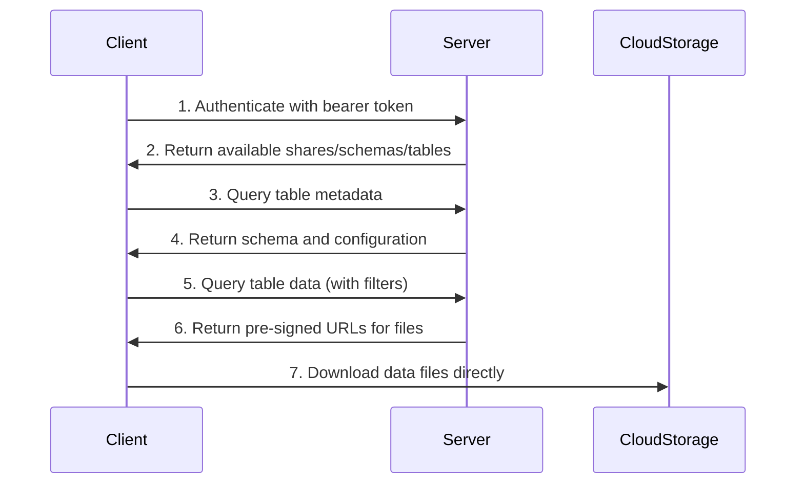

Delta Sharing is an open protocol for secure real-time exchange of large datasets. It uses a simple REST-based architecture that leverages modern cloud storage systems like S3, ADLS, and GCS to reliably transfer large datasets without requiring recipients to deploy a specific platform first.

## Protocol Architecture

The Delta Sharing protocol defines REST APIs and message formats used by clients and servers to exchange data. It enables direct access to shared data through various tools including Pandas, Apache Spark, Tableau, and any system implementing the protocol.

### Key Design Principles

<CardGroup cols={2}>
  <Card title="Cloud-Native" icon="cloud">
    Leverages cloud storage systems (S3, ADLS, GCS) for reliable large-scale data transfer
  </Card>
  <Card title="Secure" icon="lock">
    Uses bearer token authentication and pre-signed URLs for secure access control
  </Card>
  <Card title="Open Standard" icon="code">
    Platform-agnostic protocol that works across different data platforms
  </Card>
  <Card title="Efficient" icon="gauge">
    Supports predicate pushdown, file-level statistics, and optimized metadata queries
  </Card>
</CardGroup>

## REST API Structure

All Delta Sharing REST APIs use bearer tokens for authorization. The API endpoints follow a consistent pattern:

```
{prefix}/shares/{share}/schemas/{schema}/tables/{table}
```

Where:
- **prefix**: Configurable server endpoint (e.g., `https://sharing.delta.io/delta-sharing/`)
- **share**: The share name (case-insensitive)
- **schema**: The schema name (case-insensitive)
- **table**: The table name (case-insensitive)

## Authentication

Delta Sharing uses [RFC 6750 bearer token authentication](https://tools.ietf.org/html/rfc6750). Every API request must include an authorization header:

```http
Authorization: Bearer {token}
```

The bearer token is provided to recipients through a [profile file](/concepts/profile-files), which contains:
- Server endpoint URL
- Bearer token for authentication
- Token expiration time (optional)
- Protocol version information

### Response Codes

All APIs return standard HTTP status codes:

| Status | Meaning |
|--------|--------|
| **200** | Request successful |
| **400** | Malformed request |
| **401** | Unauthenticated (missing or incorrect token) |
| **403** | Forbidden (insufficient permissions) |
| **404** | Resource not found |
| **500** | Server error |

Error responses include JSON with `errorCode` and `message` fields:

```json
{
  "errorCode": "RESOURCE_NOT_FOUND",
  "message": "The requested table does not exist"
}
```

## Core API Endpoints

### Discovery APIs

These APIs help recipients discover available resources:

<AccordionGroup>
  <Accordion title="List Shares">
    **GET** `{prefix}/shares`
    
    Returns all shares accessible to the recipient with pagination support.
    
    ```json
    {
      "items": [
        {
          "name": "vaccine_share",
          "id": "edacc4a7-6600-4fbb-85f3-a62a5ce6761f",
          "displayName": "Vaccine Share"
        }
      ],
      "nextPageToken": "..."
    }
    ```
  </Accordion>

  <Accordion title="List Schemas">
    **GET** `{prefix}/shares/{share}/schemas`
    
    Returns all schemas in a share.
    
    ```json
    {
      "items": [
        {
          "name": "acme_vaccine_data",
          "share": "vaccine_share"
        }
      ]
    }
    ```
  </Accordion>

  <Accordion title="List Tables">
    **GET** `{prefix}/shares/{share}/schemas/{schema}/tables`
    
    Returns all tables in a schema with metadata about supported access modes.
    
    ```json
    {
      "items": [
        {
          "name": "vaccine_patients",
          "schema": "acme_vaccine_data",
          "share": "vaccine_share",
          "accessModes": ["url", "dir"]
        }
      ]
    }
    ```
  </Accordion>
</AccordionGroup>

### Data Access APIs

<AccordionGroup>
  <Accordion title="Query Table Metadata">
    **GET** `{prefix}/shares/{share}/schemas/{schema}/tables/{table}/metadata`
    
    Returns table schema, format, partition columns, and configuration.
    
    Response uses newline-delimited JSON (NDJSON) format with:
    - Protocol version information
    - Table metadata (schema, partitions, configuration)
    
    ```
    {"protocol":{"minReaderVersion":1}}
    {"metaData":{"id":"f8d5c169-3d01-4ca3-ad9e-7dc3355aedb2","format":{"provider":"parquet"},"schemaString":"..."}}
    ```
  </Accordion>

  <Accordion title="Query Table Data">
    **POST** `{prefix}/shares/{share}/schemas/{schema}/tables/{table}/query`
    
    Returns data files with optional filtering and limits.
    
    Request body supports:
    - `predicateHints`: SQL filter expressions
    - `limitHint`: Row limit hint
    - `version`: Time travel to specific version
    - `timestamp`: Time travel to specific timestamp
    
    ```json
    {
      "predicateHints": ["date >= '2021-01-01'"],
      "limitHint": 1000,
      "version": 123
    }
    ```
  </Accordion>

  <Accordion title="Query Table Version">
    **GET** `{prefix}/shares/{share}/schemas/{schema}/tables/{table}/version`
    
    Lightweight API to check table version for cache validation.
    
    Returns version in response header:
    ```
    Delta-Table-Version: 123
    ```
  </Accordion>
</AccordionGroup>

## Data Flow

The typical data access flow works as follows:



<Steps>
  <Step title="Authentication">
    Client authenticates using bearer token from profile file
  </Step>
  <Step title="Discovery">
    Client discovers available shares, schemas, and tables
  </Step>
  <Step title="Metadata Query">
    Client retrieves table schema and configuration
  </Step>
  <Step title="Data Query">
    Client requests data with optional filters and limits
  </Step>
  <Step title="Direct Access">
    Server returns pre-signed URLs; client downloads directly from cloud storage
  </Step>
</Steps>

## Response Format

Metadata and data query responses use newline-delimited JSON (NDJSON) format:

```json
{"protocol":{"minReaderVersion":1}}
{"metaData":{...}}
{"file":{"url":"https://...","id":"591723a8-...","size":573}}
{"file":{"url":"https://...","id":"8b0086f2-...","size":573}}
```

Each line is a complete JSON object containing one of:
- **protocol**: Version requirements
- **metaData**: Table schema and configuration
- **file**: Data file with pre-signed URL
- **add/remove/cdf**: Change data feed actions

<Info>
The NDJSON format enables efficient streaming of large result sets without loading the entire response into memory.
</Info>

## Protocol Versioning

The protocol uses versioning to maintain backward compatibility:

- **minReaderVersion**: Minimum protocol version required to read responses
- Currently set to `1` for all tables
- Will increment for non-forward-compatible changes
- Clients should validate they support the required version

```json
{
  "protocol": {
    "minReaderVersion": 1
  }
}
```

<Warning>
When `minReaderVersion` increases, older clients must upgrade to continue accessing the data.
</Warning>

## Capabilities Header

Clients can advertise capabilities through the `delta-sharing-capabilities` header:

```http
delta-sharing-capabilities: responseformat=delta;readerfeatures=deletionvectors
```

Supported capabilities:
- **responseformat**: `parquet` (default) or `delta` format
- **readerfeatures**: Comma-separated Delta features (e.g., `deletionvectors`, `columnmapping`)
- **includeEndStreamAction**: Request end-of-stream markers

This allows servers to provide optimized responses based on client capabilities.

## Next Steps

<CardGroup cols={2}>
  <Card title="Data Model" icon="sitemap" href="/concepts/shares-schemas-tables">
    Learn about the hierarchical structure of shares, schemas, and tables
  </Card>
  <Card title="Access Modes" icon="key" href="/concepts/access-modes">
    Understand URL-based vs directory-based access patterns
  </Card>
  <Card title="Profile Files" icon="file" href="/concepts/profile-files">
    Configure authentication with profile files
  </Card>
  <Card title="API Reference" icon="code" href="/api-reference">
    Explore detailed API specifications
  </Card>
</CardGroup>