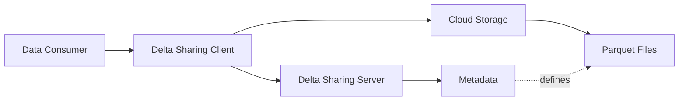

Delta Sharing is an open protocol for secure real-time exchange of large datasets, enabling organizations to share data across different computing platforms without complex integrations or data duplication.

## What is Delta Sharing?

Delta Sharing is a simple [REST protocol](https://github.com/delta-io/delta-sharing/blob/main/PROTOCOL.md) that securely shares access to part of a cloud dataset. It leverages modern cloud storage systems—such as S3, ADLS, or GCS—to reliably transfer large datasets.

<Note>
With Delta Sharing, users can connect directly to shared data through pandas, Tableau, Apache Spark, or any system supporting the protocol, without deploying specific compute platforms first.
</Note>

### Key Benefits

<CardGroup cols={2}>
  <Card title="Universal Access" icon="globe">
    Share data once and reach consumers using Python, Spark, Tableau, Power BI, and more
  </Card>
  <Card title="No Data Duplication" icon="clone">
    Recipients access data directly from cloud storage without copying
  </Card>
  <Card title="Real-Time Updates" icon="bolt">
    Consumers always see the latest data as providers update tables
  </Card>
  <Card title="Simple Integration" icon="plug">
    Minutes to start consuming data, not months of platform deployment
  </Card>
</CardGroup>

## Core Concepts

Delta Sharing organizes shared data using a three-level hierarchy:

### Share

A **share** is a logical grouping of data shared with recipients. A share can be shared with one or multiple recipients, who can access all resources within it. A share may contain multiple schemas.

```
vaccine_share/
├── acme_vaccine_ingredient_data/
└── acme_vaccine_patient_data/
```

### Schema

A **schema** is a logical grouping of tables within a share. Schemas help organize related tables together.

```
vaccine_share/
└── acme_vaccine_data/
    ├── vaccine_ingredients
    ├── vaccine_patients
    └── vaccine_trials
```

### Table

A **table** is a Delta Lake table or a view on top of a Delta Lake table. Tables contain the actual data that recipients query.

<Accordion title="Example: Fully Qualified Table Name">
  A table is referenced using the format:
  ```
  <share-name>.<schema-name>.<table-name>
  ```
  
  For example:
  ```
  vaccine_share.acme_vaccine_data.vaccine_patients
  ```
</Accordion>

### Recipient

A **recipient** is a principal with a bearer token to access shared tables. Recipients authenticate using profile files containing their credentials.

## How Delta Sharing Works

<Steps>
  <Step title="Provider Shares Data">
    The data provider configures a Delta Sharing Server and creates shares containing schemas and tables. They generate profile files for recipients.
  </Step>
  
  <Step title="Recipient Gets Profile">
    Recipients receive a profile file (JSON) containing:
    - Server endpoint URL
    - Authentication token
    - Protocol version
  </Step>
  
  <Step title="Client Connects">
    Recipients use Delta Sharing connectors (Python, Spark, etc.) with the profile file to connect to the sharing server.
  </Step>
  
  <Step title="Data Access">
    The connector queries the REST API to:
    - List available tables
    - Get table metadata and schema
    - Receive pre-signed URLs or credentials to read data files directly from cloud storage
  </Step>
</Steps>

## Architecture Overview

Delta Sharing uses a simple architecture that separates metadata management from data transfer:



<Accordion title="Architecture Components">
  **Delta Sharing Server**
  - Authenticates recipients
  - Provides table metadata and schemas
  - Issues pre-signed URLs or temporary credentials for data access
  - Does NOT serve the actual data

  **Cloud Storage**
  - Hosts the actual Parquet data files
  - Supports S3, ADLS, GCS, and more
  - Recipients read directly using pre-signed URLs

  **Delta Sharing Client**
  - Python Connector: Read as pandas DataFrames
  - Spark Connector: Read as Spark DataFrames
  - Community connectors: Power BI, Tableau, R, Rust, Java, and more
</Accordion>

## Access Modes

Delta Sharing supports two ways to access table data:

### URL-Based Access

The server returns pre-signed URLs for individual data files. The client fetches files via HTTP.

- Best for: Ad-hoc queries, small-to-medium datasets
- Advantages: Simple, works everywhere
- How it works: Server generates time-limited URLs for each Parquet file

### Directory-Based Access

The server issues temporary cloud credentials (e.g., AWS STS tokens) so clients can read the Delta log and data files directly using cloud storage APIs.

- Best for: Large datasets, streaming, advanced Delta features
- Advantages: Better performance, supports Change Data Feed (CDF)
- How it works: Client reads Delta transaction log and data files directly

<Tip>
Most servers support both access modes. The client automatically chooses the best method based on capabilities.
</Tip>

## Supported Platforms

Delta Sharing has official connectors and a growing ecosystem of community implementations:

### Official Connectors

- **Python Connector**: Read shared tables as pandas or Spark DataFrames
- **Apache Spark Connector**: Read shared tables in Spark SQL, PySpark, Scala, Java, or R
- **Delta Sharing Server**: Reference implementation for sharing Delta Lake and Parquet tables

### Community Connectors

- Power BI (Databricks)
- Tableau
- R, Rust, Java, Node.js, Clojure
- Google Sheets
- And many more...

## What's Next?

Ready to start using Delta Sharing? Continue to the [Quickstart](/quickstart) to get up and running in minutes.

<CardGroup cols={2}>
  <Card title="Quickstart" icon="rocket" href="/quickstart">
    Get started with Delta Sharing in minutes
  </Card>
  <Card title="Protocol Specification" icon="book" href="https://github.com/delta-io/delta-sharing/blob/main/PROTOCOL.md">
    Dive deep into the Delta Sharing Protocol
  </Card>
</CardGroup>