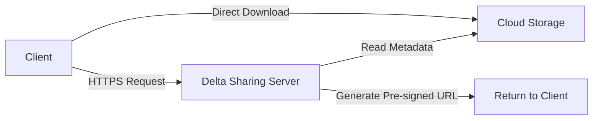

## What is the Delta Sharing Reference Server?

The Delta Sharing Reference Server is a reference implementation of the [Delta Sharing Protocol](/protocol/overview) that enables you to share Delta Lake and Apache Parquet tables stored on cloud object storage (S3, Azure Blob Storage, ADLS Gen2, GCS, Cloudflare R2) with consumers.

This lightweight server provides a REST API that clients can use to discover and access shared data without copying it. The server generates pre-signed URLs that allow clients to read data files directly from your cloud storage, ensuring efficient data transfer and minimal overhead.

## When to Use the Reference Server

The reference server is ideal for:

<CardGroup cols={2}>
  <Card title="Development & Testing" icon="flask">
    Testing Delta Sharing connectors and integrations during development
  </Card>
  <Card title="Small-Scale Sharing" icon="users">
    Sharing datasets with a limited number of trusted recipients
  </Card>
  <Card title="Proof of Concepts" icon="lightbulb">
    Quickly demonstrating Delta Sharing capabilities
  </Card>
  <Card title="Self-Hosted Solutions" icon="server">
    Organizations that need full control over their sharing infrastructure
  </Card>
</CardGroup>

<Warning>
  The reference server is **not a production-ready, secure web server**. It's designed for development and small-scale use cases. For production deployments, we strongly recommend placing it behind a secure proxy (like NGINX) with proper authentication and authorization.
</Warning>

## When to Use Managed Alternatives

For production workloads with enterprise requirements, consider managed Delta Sharing services:

### Databricks Delta Sharing

[Databricks](https://databricks.com/product/delta-sharing) provides a fully managed Delta Sharing service with:

- **Enterprise security**: Built-in authentication, authorization, and audit logging
- **Scalability**: Handles high-volume data sharing across thousands of recipients
- **Unity Catalog integration**: Centralized governance and access control
- **No infrastructure management**: Fully managed service with high availability
- **Fine-grained permissions**: Row-level and column-level security
- **Monitoring and analytics**: Track usage and access patterns

### Other Vendors

Several vendors offer Delta Sharing capabilities. Check the [community connectors](/community/overview) page for a list of available providers.

## Architecture Overview

The reference server operates as a stateless REST API server:

<Steps>
  <Step title="Client Request">
    A Delta Sharing client (Python, Spark, etc.) sends a request to the server for table metadata or data
  </Step>
  
  <Step title="Server Processing">
    The server authenticates the request, reads Delta Lake metadata from cloud storage, and applies any filters
  </Step>
  
  <Step title="Pre-signed URLs">
    The server generates pre-signed URLs for the data files and returns them to the client
  </Step>
  
  <Step title="Direct Download">
    The client uses the pre-signed URLs to download data files directly from cloud storage
  </Step>
</Steps>

## Key Features

<AccordionGroup>
  <Accordion title="Multi-Cloud Support">
    Share tables stored on AWS S3, Azure Blob Storage, Azure Data Lake Storage Gen2, Google Cloud Storage, and Cloudflare R2
  </Accordion>
  
  <Accordion title="Delta Lake & Parquet">
    Share both Delta Lake tables (with full history and metadata) and Apache Parquet tables
  </Accordion>
  
  <Accordion title="Change Data Feed (CDF)">
    Enable recipients to query incremental changes to shared tables when CDF is enabled
  </Accordion>
  
  <Accordion title="Predicate Pushdown">
    Support for filtering data at the source to minimize data transfer
  </Accordion>
  
  <Accordion title="Bearer Token Authentication">
    Simple token-based authentication for securing API access
  </Accordion>
  
  <Accordion title="Docker Support">
    Pre-built Docker images available for easy deployment
  </Accordion>
</AccordionGroup>

## Limitations

<Note>
  Understanding the reference server's limitations is crucial for determining if it's the right choice for your use case.
</Note>

- **Basic Authentication**: Only supports bearer token authentication out of the box
- **No User Management**: No built-in user management or fine-grained permissions
- **No Audit Logging**: Limited logging capabilities for compliance requirements
- **Manual Configuration**: Tables must be manually configured in YAML files
- **No High Availability**: Single-server deployment with no clustering support
- **Security**: Requires additional infrastructure (proxy, JWT auth) for production security

## Next Steps

<CardGroup cols={2}>
  <Card title="Install the Server" icon="download" href="/server/installation">
    Download and set up the reference server
  </Card>
  <Card title="Configure the Server" icon="gear" href="/server/configuration">
    Learn how to configure shares, schemas, and tables
  </Card>
  <Card title="Cloud Storage Setup" icon="cloud" href="/server/cloud-storage">
    Configure authentication for your cloud storage provider
  </Card>
  <Card title="Secure Your Server" icon="lock" href="/server/authorization">
    Set up authentication and authorization
  </Card>
</CardGroup>
